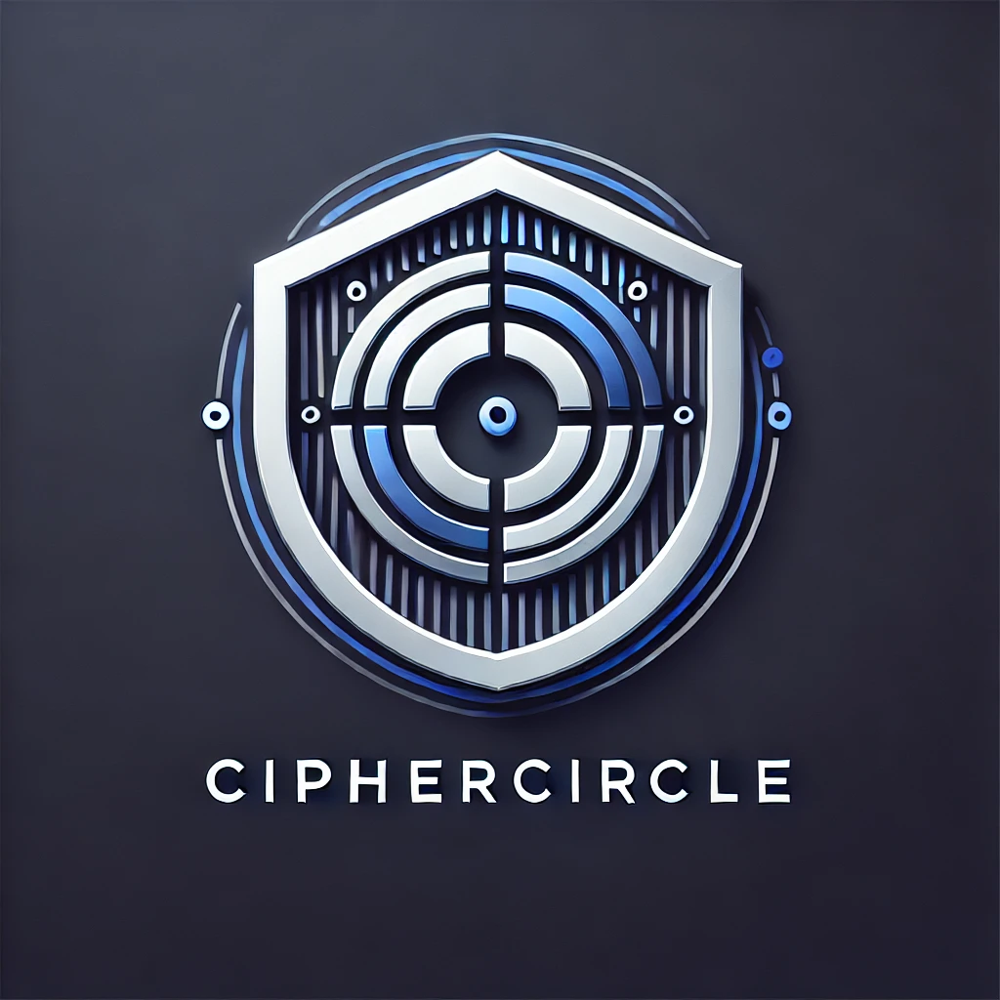
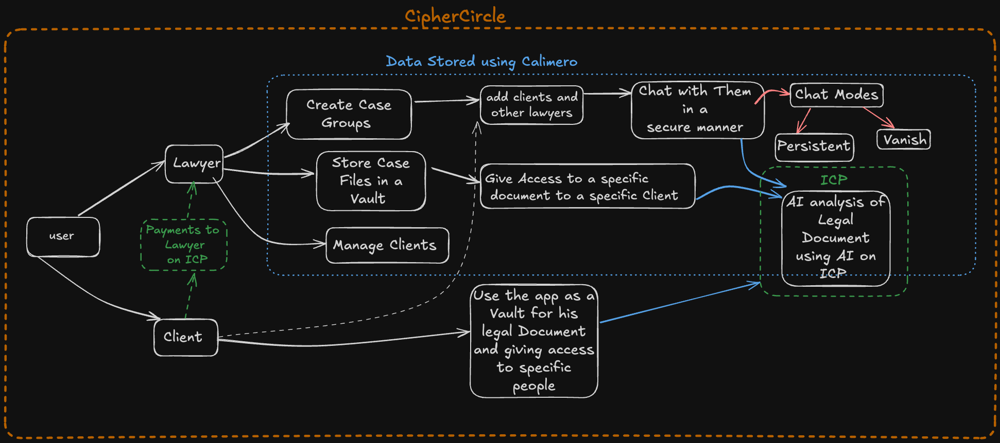

  

# CipherCircle: Decentralized Legal Communication Platform

**CipherCircle** is a next-generation **decentralized legal communication** platform, ensuring secure, encrypted interactions between **lawyers** and **clients**. Built on **Calimero** and **ICP (Internet Computer Protocol)**, it combines **confidentiality, AI-driven document analysis, and blockchain-backed security** to redefine the legal industry's digital landscape.

---

## 🚨 Why Legal Professionals Need CipherCircle

The legal industry handles highly **sensitive client information**, yet traditional digital communication methods suffer from:

- **Centralized Data Risks:**  
  Law firms store confidential case files in centralized servers, making them vulnerable to breaches.

- **Lack of Encrypted Communication:**  
  Emails and third-party messaging platforms expose legal discussions to potential eavesdropping.

- **Slow & Inefficient Workflows:**  
  Manual contract analysis, billing, and document review lead to delays and human errors.

- **Lack of Transparency & Trust:**  
  Legal professionals must rely on intermediaries for document verification and payments.

🚀 **CipherCircle eliminates these risks** by offering **secure, blockchain-powered** interactions while enabling **AI-powered legal document insights.**

---

## 🛠️ How Calimero Powers Secure Legal Communication

[Calimero](https://github.com/calimero-network) ensures **encryption** and **decentralized storage** for all legal interactions. It empowers CipherCircle with:

- **End-to-End Encrypted Messaging:**  
  Persistent or self-destructing chat options for secure lawyer-client discussions.

- **Decentralized Document Vault:**  
  Fully encrypted legal case files stored securely, accessible only via smart contracts.

- **Role-Based Access Controls:**  
  Lawyers can define granular access permissions, ensuring only authorized clients or legal teams can view specific documents.

---

## 🔗 AI on Blockchain: How ICP Enhances Legal Workflows

Using **AI on ICP**, CipherCircle revolutionizes **legal document analysis and contract management** by:

- **AI-Powered Legal Document Insights:**  
  Instant contract analysis, fraud detection, and case predictions based on historical data.

- **Smart Contract-Based Legal Agreements:**  
  Automates legal contracts, ensuring **tamper-proof execution** with on-chain transparency.

- **ICP-Based Payments & Billing:**  
  Eliminates intermediaries by enabling **transparent, token-based payments** between lawyers and clients.

💡 **By combining AI and blockchain, CipherCircle enhances efficiency, reduces errors, and builds trust in legal communications.**

---

## 📌 Key Features

- ✅ **Confidential Lawyer-Client Communication**
- ✅ **Decentralized Legal Document Vault with Fine-Grained Access Control**
- ✅ **AI-Powered Legal Document Analysis & Case Predictions**
- ✅ **Smart Contracts for Automated Legal Agreements (Will be implemented)**
- ✅ **Blockchain-Powered Transparent Billing & Payments via ICP**
- ✅ **Cross-Platform Access (Web & Mobile) with API Integrations**

---

## 🏗️ App Architecture

### 🔹 Secure Data Flow with Calimero & ICP

Below is the **app architecture flowchart**, detailing **how CipherCircle operates securely**:

  

**For Lawyers:**
- Create Case Groups & Add Clients
- Securely Store & Share Legal Documents
- Assign Role-Based Access to Clients & Team Members
- Use AI for Instant Legal Document Analysis
- Automate Contract Execution via Smart Contracts

**For Clients:**
- Securely Communicate with Lawyers
- Upload & Store Legal Documents in the Encrypted Vault
- Access AI-Powered Legal Insights
- Make Payments & Sign Agreements via ICP Smart Contracts

---

## 🚀 Getting Started

For detailed installation and setup instructions—including the frontend using pnpm and backend ICP canister deployment—please refer to [INSTALL.md](./INSTALL.md).

**Backend ICP Canister Repository:**  
[CipherCircleICP-Canister](https://github.com/rtb-12/CipherCircleICP-Canister.git)
---

## 📜 License

This project is licensed under the **MIT License**. See the `LICENSE` file for more details.
